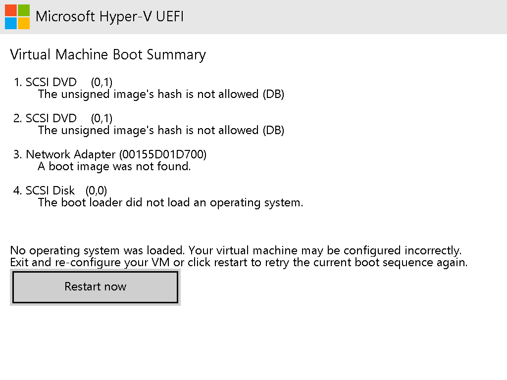
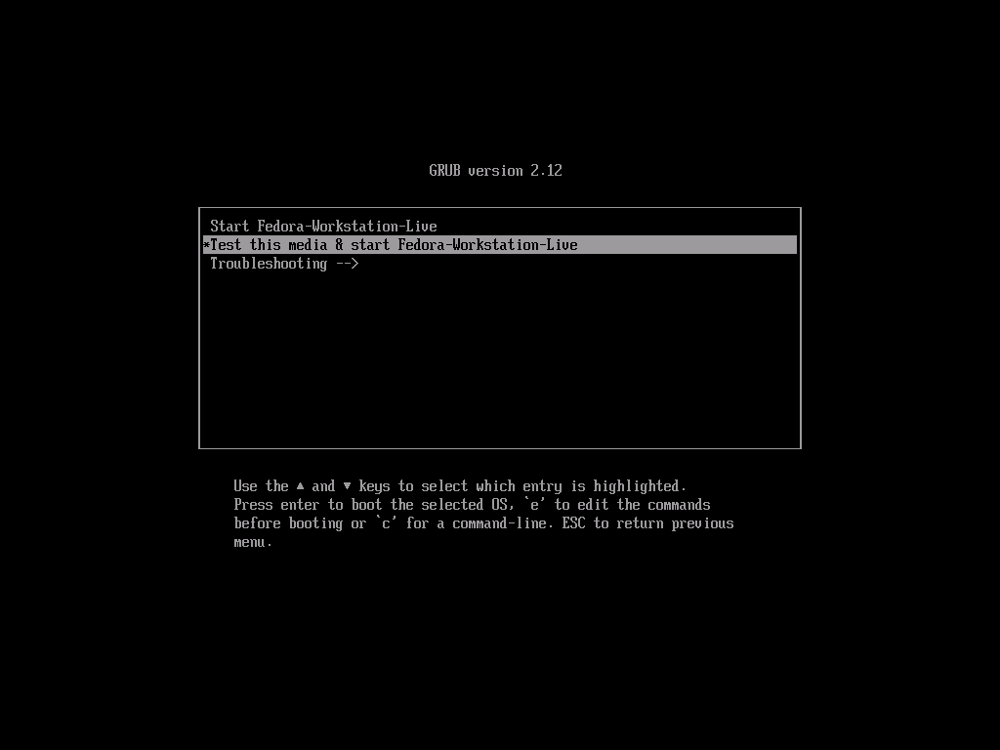
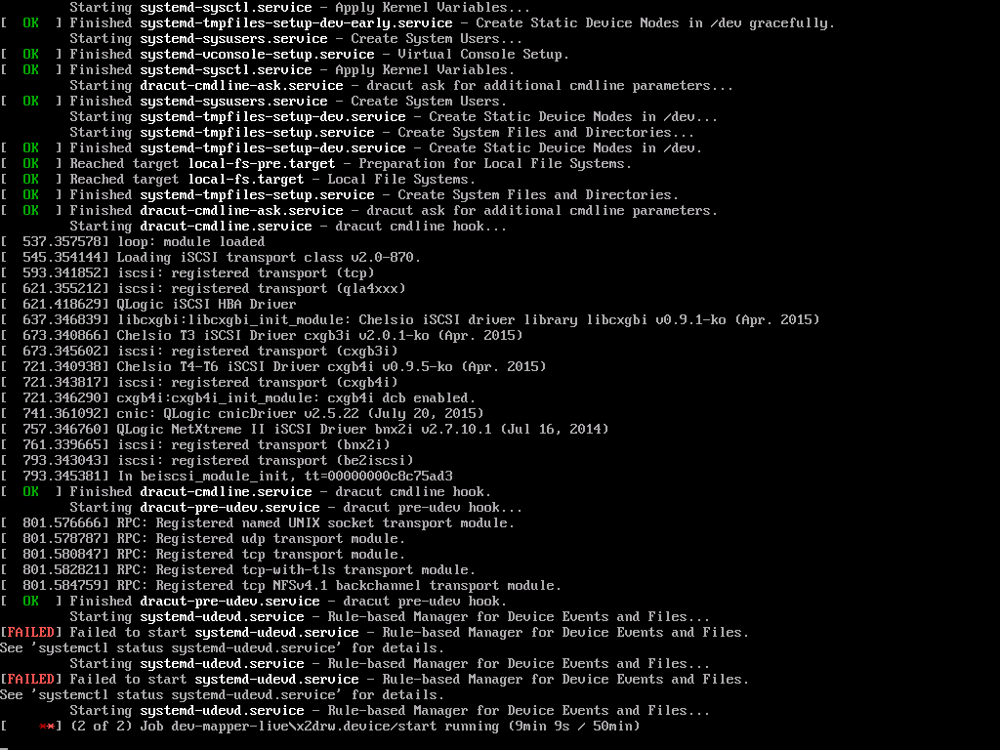
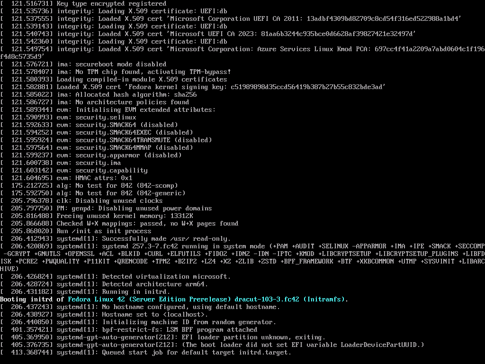
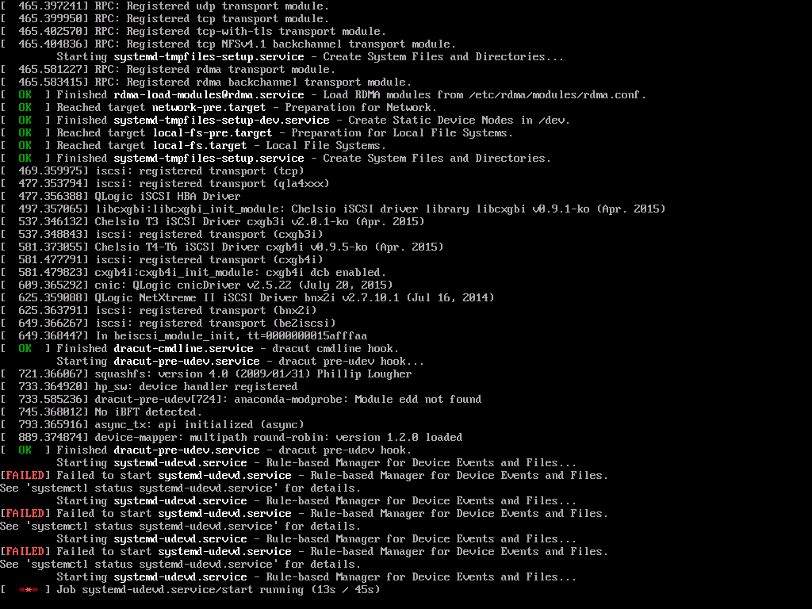
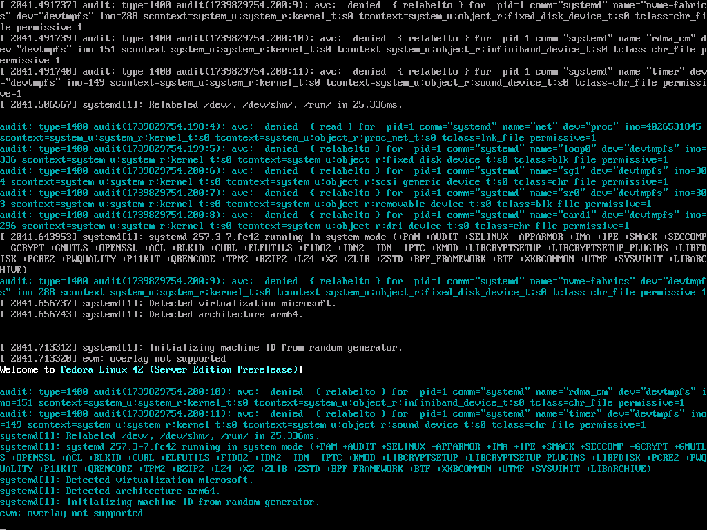

# Setup / Testing Environment

Windows 11 24h2 Pro (Hyper-V is not available on Home)

# Installation Notes

Grabbed `aarch64` isos from https://openqa.fedoraproject.org/nightlies.html

Had to disable secure boot - seems to not be signed.

# Bugs

## No signed bootloader for aarch64

With "Microsoft UEFI Certificate Signing Authority" - secure boot still fails. This works for x86_64. I had to disable it. 

Seems to be tracked in https://pagure.io/fedora-infrastructure/issue/7361

## Booting gets stuck

The initial text-mode menu comes up fine, but choosing either boot option hangs.

A quick web search shows others have hit this on Ubuntu 24.10 as well under Hyper-V
https://discourse.ubuntu.com/t/ubuntu-24-10-concept-snapdragon-x-elite/48800/103

### Getting more details

At the boot menu, hit `e` to edit the command line. Remove `quiet`, then press f10.

Things don't seem to be completely hung, but they are moving very slowly. Seeding the kernel RNG takes about 3-4 minutes. `vmmem` shows 50% CPU utilization for most of that time. I think that generally indicates that a lot of instructions need to be trapped and emulated which could definitely be the case if the Hyper-V drivers are missing.

Eventually `systemd-udevd.service` fails to start repeatedly

As for next steps, my best guess is that diffing the kconfig https://github.com/microsoft/WSL2-Linux-Kernel/blob/linux-msft-wsl-6.6.y/arch/arm64/configs/config-wsl-arm64 to that of Fedora's may provide some clues.

### Comparing to server

RNG took about 200s . Booting is very slow, seems to be stuck on `systemd-udev` consistent with workstation

